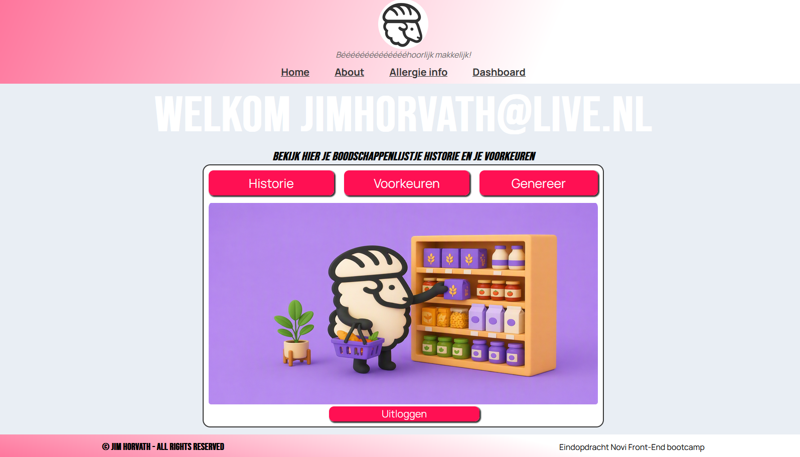

# Broodschaap-app

> Front-end eindopdracht voor de leerlijn Full-stack developer  
> Eindopdracht - FRO 2026/02

**Bedacht en ontwikkeld door:** Jim Horvath  
**Geschreven op:** 19 juni 2026  
**Ingeleverd op:** 19 juni 2026

\---

## Inhoudsopgave

* [1. Inleiding](#1-inleiding)
* [2. Gebruikte technieken en frameworks](#2-gebruikte-technieken-en-frameworks)

  * [2.1 Gebruikte technieken](#21-gebruikte-technieken)
  * [2.2 APIs](#22-apis)
* [3. Installatie](#3-installatie)

  * [3.1.1 De repository clonen](#311-de-repository-clonen)
  * [3.1.2 De repository openen in je IDE](#312-de-repository-openen-in-je-ide)
  * [3.2 De applicatie configureren](#32-de-applicatie-configureren)
  * [3.3 De applicatie laten werken](#33-de-applicatie-laten-werken)
  * [3.4 De NOVI back-end](#34-de-novi-back-end)
* [4. Projectstructuur](#4-projectstructuur)
* [5. Gebruik van de applicatie](#5-gebruik-van-de-applicatie)

  * [5.1.1 Inloggen / Registreren](#511-inloggen--registreren)
  * [5.1.2 Safeguard](#512-safeguard)
* [Auteur](#auteur)
* [Licentie](#licentie)

\---

## 1\. Inleiding
De broodschaap-app is een React webapplicatie waarmee gebruikers op meerdere manieren snel en efficiënt een boodschappenlijst kunnen laten genereren op basis van hun familie grootte, budget, budget per periode en allergieën. 
De vier kernfunctionaliteiten van de app zijn:

1. registreren en inloggen;
2. boodschappenlijstvoorkeuren maken en opslaan;
3. boodschappenlijstjes genereren op basis van voorkeuren;
4. gemaakte boodschappenlijst-historie inzien.

### Voorbeeld: accountdashboard



\---

## 2\. Gebruikte technieken en frameworks

### 2.1 Gebruikte technieken

De applicatie gebruikt de volgende technieken:

* React;
* JavaScript;
* CSS;
* React Router DOM;
* Axios.

De applicatie is ontwikkeld als een Single Page Application met behulp van React. 
Voor de ontwikkelomgeving en bundeling van de applicatie is Vite gebruikt. 
De applicatie maakt gebruik van component-gebasseerde structuur, React Router voor navigatie tussen de pagina’s en Axios voor API communicatie.
De styling is gerealiseerd in CSS waarbij responsive design is toegepast waardoor de applicatie beter bruikbaar is op mobiele als desktop apparaten.


### 2.2 APIs

De applicatie gebruikt:

* NOVI Back-end API;
* Official Joke API.

De NOVI back-end is gebruikt voor gebruiker registratie en inloggen, en de Official Joke API is gebruikt dat zodra de gebruiker naar de Historie page gaat en deze nog leeg is, er een grap zichtbaar is. 


\---

## 3\. Installatie

### 3.1.1 De repository clonen

Volg deze stappen om de repository te clonen:

1. Open je IDE, bijvoorbeeld WebStorm, Visual Studio Code.
2. Ga in je browser (bv Firefox, Chrome, of Edge) naar de volgende link: https://github.com/Deaddrums/FrontEnd-eindopdracht-NOVI.
3. Controleer dat je de juiste branch hebt geselecteerd.
4. Klik op de groene **Code**-knop.
5. Zorg dat **Local** is geselecteerd en niet **Codespaces**.
6. Kopieer de git@github link die daar zichtbaar wordt. 
7. Ga vervolgens terug naar je IDE
 (Voor de volgende stappen wordt Webstorm IDE gebruikt als voorbeeld)
8. Ga naar de vier horizontale strepen linksboven het scherm
9. Nu wordt je taskbar zichtbaar
10. Ga naar Git en zie dat de optie ‘Clone’ verschijnt in de dropwdown
11. Klik op clone en je ziet een venster verschijnen
12. Hier kan je de URL invoeren die je hebt gekopieerd van Github
13. Nu heb je de applicatie goed binnen gehaald en kan je naar stap 3.2!


Heb je de applicatiefolder handmatig gedownload? Ga dan verder met [3.1.2 De repository openen in je IDE](#312-de-repository-openen-in-je-ide).

### 3.1.2 De repository openen in je IDE

Heb je de applicatie (folder) handmatig gedownload? Volg dan de volgende stappen:

1.Open je IDE software  (zoals Webstorm, Arduino of Visual studio)
2. Ga in je browser (bv Firefox, Chrome, of Edge) naar de volgende link: https://github.com/Deaddrums/FrontEnd-eindopdracht-NOVI
3. Controleer dat je de main branch hebt geselecteerd (zie screenshot)
4. Klik vervolgens op de groene “code knop” (zie screenshot) 
5. Zorg dat je Local selecteerd en niet Codespaces.
6. Selecteer Download ZIP
7. En selecteer een bestemming voor je ZIP bestand
8. Ga naar de bestemming waar je ZIP bestand op binnen is gekomen en extract deze (rechtermuis knop en zoekt Extract all) en je ziet nu dat het ZIP bestandje een folder is       geworden.
9. Ga weer terug naar je IDE en selecteer de vier horizontale strepen linksboven het scherm
10. Ga naar File en dan Open
11. Ga naar de locatie waar je het ZIP bestand op binnen gehaald hebt
12. Selecteer de net gemaakte folder en open deze.

\---

## 3.2 De applicatie configureren

Begin met het installeren van de dependencies, dit zijn kleine hulpbestanden die belangrijke functies in de applicatie draaien. 

Om dit te doen, open de terminal en voer in het volgende command:
```bash
npm install
```

Nu kan de development server gestart worden met het volgende command:
```bash
npm run dev
```

Heb je dit succesvol gedaan, dan zie je deze tekst verschijnen:
  VITE v8.0.16  ready in 295 ms

  ➜  Local:   http://localhost:5173/ 
  ➜  Network: use --host to expose
  ➜  press h + enter to show help

Je kan nu de applicatie bereiken door naar http://localhost:5173/ te gaan in je Browser (of simpelweg op de hyperlink klikken).

> \*\*Let op:\*\* Zorg dat je wel de `localhost van 5173` draait, een andere origin zorgt ervoor dat de NOVI back-end je toegang blokkeerd!!

\---

## 3.3 De applicatie laten werken

Na het openen van het project moet er nog een belangrijk bestand aanwezig zijn:

```text
.env
```

Dit bestand staat bewust niet op GitHub. In dit bestand staan lokale configuratiewaarden die nodig zijn voor de back-endverbinding.

### 3.3.1 `.env` zelf aanmaken

Maak in de root van het project een nieuw bestand aan met exact deze naam:

```text
.env
```

De root is dezelfde map waarin ook `package.json`, `vite.config.js` en `README.md` staan.

Gebruik deze structuur:

```env
VITE_PROJECT_ID=6dc266a5-f7e7-48b9-b611-ba16d2a28f65
VITE_API_BASE_URL=https://novi-backend-api-wgsgz.ondigitalocean.app/api

VITE_OANOR_API_KEY=oanor_live_e8aacdfe96692e9f7b79f2f057bee741f9bcb2f3b2a01b663f0026a3b509c1
```


### 3.3.2 `.env` handmatig toevoegen

Als je een `.env` bestand hebt ontvangen, plaats dit bestand dan in de root van het project:

```text
project-root/
├── .env
├── package.json
├── vite.config.js
├── src/
└── public/
```

Plaats het bestand dus niet in:

```text
src/.env
public/.env
```

Na het toevoegen of aanpassen van `.env` moet je Vite opnieuw starten:

```bash
Ctrl + C
npm run dev
```

\---

## 3.4 De NOVI back-end

Het kan gebeuren dat de NOVI back-end opnieuw ingesteld moet worden. Volg dan deze algemene stappen:

1. Open de NOVI back-endpagina.
2. Ga naar het onderdeel **API configureren**.
3. Bij ‘Jouw prodict ID’ vul dan de key in: 6dc266a5-f7e7-48b9-b611-ba16d2a28f65
(Dit is de key die ook in de VITE_PROJECT_ID staat)

4. Tijd om de UserIdData.json file te vinden om toe te voegen
5. Deze kan je vinden in de folder locatie waar je de applicatie hebt gezet, dan naar src gaat, daar naar assets, dan naar Data.
  (deze kan je standaard vinden onder C:\Users\user\WebstormProjects\FrontEnd-eindopdracht-NOVI)
6. De totale link is dan: C:\Users\user\WebstormProjects\FrontEnd-eindopdracht-NOVI\src\assets\Data
   Let op dat de folder ‘user’ de naam is van de gebruiker (bijvoorbeeld jim.horvath) en niet letterlijk ‘user’. (‘Users’ is daarintegen wel de correcte folder naam)
7. Ga weer terug naar de NOVI back-end en klik op ‘Browse’ om de UserIdData.json file toevoegen
8. Als de key ingevuld is en de JSON file geplaatst is klik dan op “upload API configuratie” om de API online te zetten. 


Het configuratiebestand staat in de projectstructuur onder:

```text
src/assets/Data/UserIdData.json
```

Voorbeeld van een Windows-pad:

```text
C:\\Users\\jouw-gebruikersnaam\\WebstormProjects\\FrontEnd-eindopdracht-NOVI\\src\\assets\\Data
```


\---

## 4\. Projectstructuur

De Broodschaap-app hanteert deze structuur:

```text
src
|
|-- assets
|   |-- Api
|   |-- Components
|   |-- Context
|   |-- Data
|   |-- Helpers
|   |-- Pages
|   |-- Styling
|   `-- images
|
|-- App.jsx
|-- App.css
|-- main.jsx
`-- index.css
```

|Map of bestand|Functie|
|-|-|
|`assets/Api`|Bevat de endpoints voor de API.|
|`assets/Components`|Bevat herbruikbare componenten.|
|`assets/Context`|Bevat context voor onder andere inloggen.|
|`assets/Data`|Bevat databestanden zoals `AllergyData.json` en `UserIdData.json`.|
|`assets/Helpers`|Bevat helpers zoals `PasswordConfirmer`.|
|`assets/images`|Bevat afbeeldingen van de app.|
|`assets/Pages`|Bevat de losse pagina-elementen.|
|`App.jsx`|Hoofdcomponent van de applicatie.|
|`App.css`|Algemene styling van de applicatie.|
|`main.jsx`|Entry point van de React-applicatie.|
|`index.css`|Algemene basisstyling.|

\---

## 5\. Gebruik van de applicatie

### 5.1.1 Inloggen / Registreren

#### Registreren

Om een account aan te maken:

1. Ga naar `/Register`.
2. Vul je naam, e-mailadres en wachtwoord in.
3. Herhaal het wachtwoord bij **Bevestig wachtwoord**.
4. Controleer of beide wachtwoordvelden correct zijn.
5. Als alles klopt, wordt de registratieknop actief.
6. Na registratie verschijnt een pop-upmelding.
7. Bij een succesvolle registratie word je automatisch doorgestuurd naar de loginpagina.

#### Inloggen

Om in te loggen:

1. Ga naar `/Login`.
2. Vul het e-mailadres en wachtwoord in waarmee je hebt geregistreerd.
3. Controleer of het e-mailadres correct is ingevuld.
4. Als het e-mailveld en wachtwoord correct zijn ingevuld, wordt de loginbutton actief.

> De e-mailvalidatie controleert alleen de vorm van het e-mailadres. De validatie controleert niet of het account werkelijk bestaat in de back-end.


### 5.1.2 Safeguard

In het geval dat de NOVI back-end toch niet werkt is er een account hardcoded in de UserIdData.json file local aangemaakt.

Email: jimhorvath@live.nl
Password: admin123

Dit is een puur een account die testdoeleinden is opgezet, op het moment dat deze applicatie echt “actief” zou gaan zal deze account verwijderd worden uit de dataset. 

Verder zijn er geen andere (npm) commando’s aanwezig. 


\---

## Auteur

**Jim Horvath**  
NOVI Hogeschool  
Front-End Development Eindopdracht  
2026

\---

## Licentie

Dit project is ontwikkeld als onderdeel van de eindopdracht van de opleiding Front-End Development aan NOVI Hogeschool.

\---
